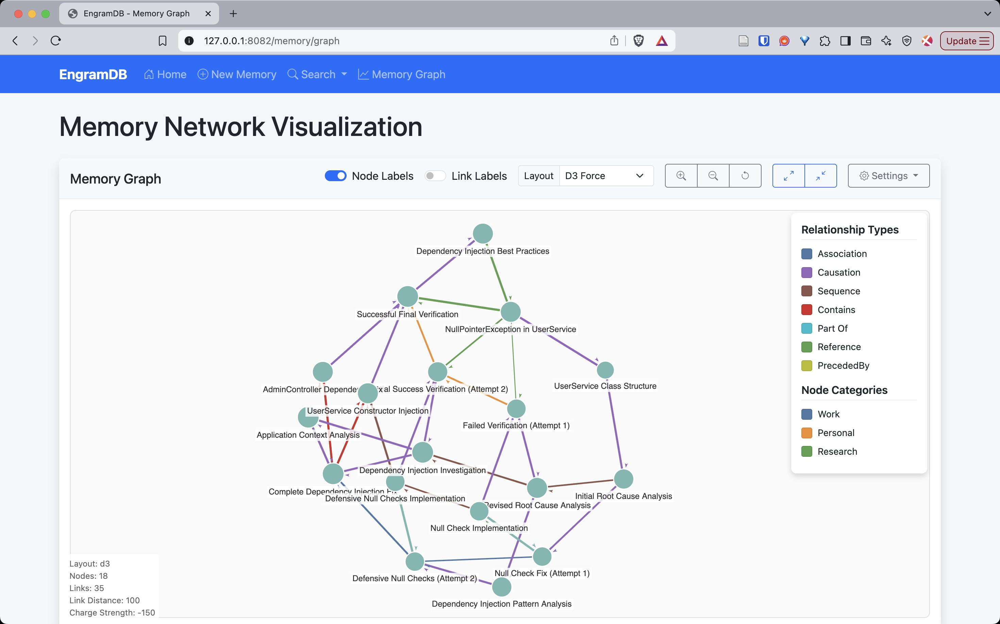

# EngramDB: Engram Database

EngramDB is a specialized database system designed specifically for agent memory management. It provides efficient storage, retrieval, and querying of agent memories using a unified memory representation model.

## Core Features

- **Unified Memory Representation**: Combines graph, vector, and temporal properties in a single primitive
- **Vector Similarity Search**: Find memories with similar semantic content
- **Flexible Storage Options**: In-memory database for testing and development, file-based for persistence
- **Query API**: Rich querying with vector similarity, attribute filters, and temporal constraints
- **Memory Evolution**: Track changes to memories over time with temporal layers
- **Python Bindings**: First-class Python API for integration with ML and AI applications
- **Web Interface**: Browser-based UI for visualization and interaction with the database



## Getting Started

### Prerequisites

- Rust 2021 edition (for Rust development)
- Cargo (for building from source)
- Python 3.7+ (for Python bindings)
- Flask (for web interface)

### Installation

#### Rust Library

Clone the repository and build the project:

```bash
git clone https://github.com/yourusername/engramdb.git
cd engramdb
cargo build
```

#### Python Package

Install using pip:

```bash
pip install engramdb-py
```

Or build from source:

```bash
cd engramdb/python
pip install maturin
maturin develop
```

### Running Examples

#### Rust Examples

EngramDB includes several Rust examples that demonstrate different features:

```bash
# Run the basic usage example
cargo run --example basic_usage

# Run the memory graph example
cargo run --example memory_graph

# Run the storage comparison example
cargo run --example memory_and_file_storage

# Run the unified database example
cargo run --example unified_database
```

#### Python Examples

Python examples are available in the `python/examples` directory:

```bash
# Run the basic Python example
cd python
python examples/basic_usage.py

# Run other examples
python examples/simple_test.py
python examples/final_demo.py
```

#### Web Interface



The web interface provides a visual way to interact with the database:

```bash
# Quick start with the provided script
cd web
./run_web.sh

# Or manual setup
cd web
python -m venv venv_app
source venv_app/bin/activate
pip install flask==2.3.3 werkzeug==2.3.7 flask-wtf==1.2.1
python app_full.py
```

Once running, access the web interface at: http://localhost:8082

## Usage

### Rust API

#### Simple Usage

```rust
use engramdb::{Database, MemoryNode};
use engramdb::core::AttributeValue;

// Create an in-memory database
let mut db = Database::in_memory();

// Create a memory node
let mut memory = MemoryNode::new(vec![0.1, 0.2, 0.3, 0.4]);
memory.set_attribute("title".to_string(),
    AttributeValue::String("Important information".to_string()));

// Save to database
db.save(&memory)?;

// Search for similar memories
let query_vector = vec![0.15, 0.25, 0.35, 0.45];
let results = db.search_similar(&query_vector, 5, 0.0)?;

// Query with filters
let results = db.query()
    .with_vector(query_vector)
    .with_attribute_filter(/* ... */)
    .with_temporal_filter(/* ... */)
    .execute()?;
```

#### Persistent Storage

```rust
use engramdb::{Database, DatabaseConfig};

// Create a persistent database
let config = DatabaseConfig {
    use_memory_storage: false,
    storage_dir: Some("./my_database".to_string()),
    cache_size: 100,
};

let mut db = Database::new(config)?;

// Or more simply
let mut db = Database::file_based("./my_database")?;

// Initialize to load existing memories into the vector index
db.initialize()?;
```

### Python API

#### Basic Usage

```python
import engramdb
import numpy as np

# Create an in-memory database
db = engramdb.Database.in_memory()

# Create a memory node with numpy embeddings
embeddings = np.array([0.1, 0.2, 0.3, 0.4], dtype=np.float32)
memory = engramdb.MemoryNode(embeddings)
memory.set_attribute("title", "Important information")
memory.set_attribute("importance", 0.8)

# Save to database
memory_id = db.save(memory)

# Search for similar memories
query_vector = np.array([0.15, 0.25, 0.35, 0.45], dtype=np.float32)
results = db.search_similar(query_vector, limit=5, threshold=0.0)

# Process results
for memory_id, similarity in results:
    memory = db.load(memory_id)
    print(f"Memory: {memory.get_attribute('title')}, Similarity: {similarity:.4f}")
```

#### Advanced Queries

```python
# Create filters
category_filter = engramdb.AttributeFilter.equals("category", "work")
importance_filter = engramdb.AttributeFilter.greater_than("importance", 0.7)

# Build and execute query
results = db.query()\
    .with_vector(query_vector)\
    .with_attribute_filter(category_filter)\
    .with_attribute_filter(importance_filter)\
    .with_limit(10)\
    .execute()

# Process results
for memory in results:
    print(f"Found: {memory.get_attribute('title')}")
```

### Web Interface

The web interface provides a user-friendly way to:

- Create, view, edit, and delete memory nodes
- Perform vector similarity searches
- Filter memories by attributes
- Visualize vector embeddings

Main features:
- **Memory List**: View all stored memories
- **Memory Creation**: Add new memories with attributes and embeddings
- **Memory Details**: View complete memory information
- **Search Interface**: Find memories by similarity or attributes

## Architecture

EngramDB is built around these core components:

1. **MemoryNode**: The fundamental unit of storage, combining:
   - Vector embeddings for semantic content
   - Graph connections to other memories
   - Temporal layers for versioning
   - Flexible attributes

2. **Storage Engines**:
   - `MemoryStorageEngine`: Fast, in-memory storage for testing
   - `FileStorageEngine`: Persistent file-based storage

3. **Vector Index**: For efficient similarity search

4. **Query System**: A fluent interface for building complex queries

5. **Database**: A unified interface combining all components

6. **Language Bindings**:
   - Core implementation in Rust for performance and safety
   - Python bindings using PyO3 for ML/AI integration

7. **Web Interface**:
   - Flask-based web application
   - Visualization and interaction with memory database
   - Mock implementation for standalone demos

## Development

### Rust Development

```bash
# Build the Rust library
cargo build

# Run tests
cargo test

# Lint code
cargo clippy

# Format code
cargo fmt
```

### Python Development

```bash
# Navigate to Python directory
cd python

# Install development dependencies
pip install -r requirements-dev.txt

# Build the Python package
maturin develop

# Run Python tests
pytest tests/
```

### Web Development

```bash
# Navigate to web directory
cd web

# Set up development environment
python -m venv venv_app
source venv_app/bin/activate

# Install dependencies
pip install -r requirements.txt

# Run development server
python app_full.py
```

## License

This project is licensed under the MIT License - see the LICENSE file for details.

## Roadmap

Future enhancements planned for EngramDB:

1. **Adaptive Embedding Indexing**: Self-optimizing index based on access patterns
2. **Predictive Memory Prefetching**: Anticipatory loading based on agent behavior
3. **Write-Optimized Memory Evolution**: Specialized LSM tree for continuous updates
4. **Reflection-Optimized Query Engine**: Query language for agent introspection patterns
5. **Cognitive-Inspired Storage Hierarchy**: Multi-tiered storage based on human memory models
6. **Advanced Python Integration**: Deeper integration with popular ML frameworks
7. **Interactive Visualizations**: Enhanced web UI with interactive memory graphs
8. **Distributed Storage Engine**: Support for clustered deployments